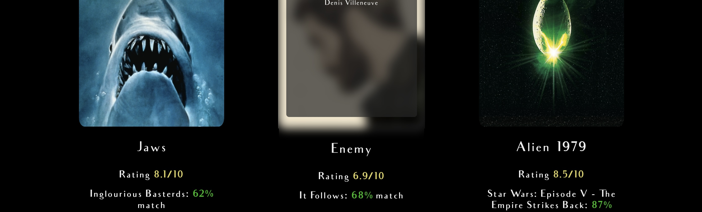

# My Movie Recommendations

Welcome to the Movie Recommendation Project! This project aims to provide users with personalized movie recommendations based on their preferences. Whether you are a movie enthusiast or looking for something new to watch, this application has got you covered.

## Table of Contents

- [Features](#features)
- [Project Structure](#project-structure)
- [Technologies Used](#technologies-used)
- [Contributing](#contributing)

## Features

- Recive personalized movie recommendations based on your selection of movies
- Simple and instuitive User-friendly interface.
- Seamless navigation between movie selection and information pages.
- Expansive and high quality information and imagery

## Contributing

Contributions are welcome! If you have any improvements or new features to suggest, feel free to open an issue or submit a pull request.

## Project Structure

├── public/             # Static assets and HTML files
├── server/             # Server-side code
│   ├── modules/        # Custom modules (e.g., database connection)
│   ├── routes/         # API routes
│   └── server.js       # Main server file
├── views/              # Dynamic HTML views
├── .gitignore          # Git ignore file
├── package.json        # NPM package configuration
└── README.md           # Project documentation

# Technologies Used

Node.js
Express.js
MongoDB
HTML/CSS
JavaScript
